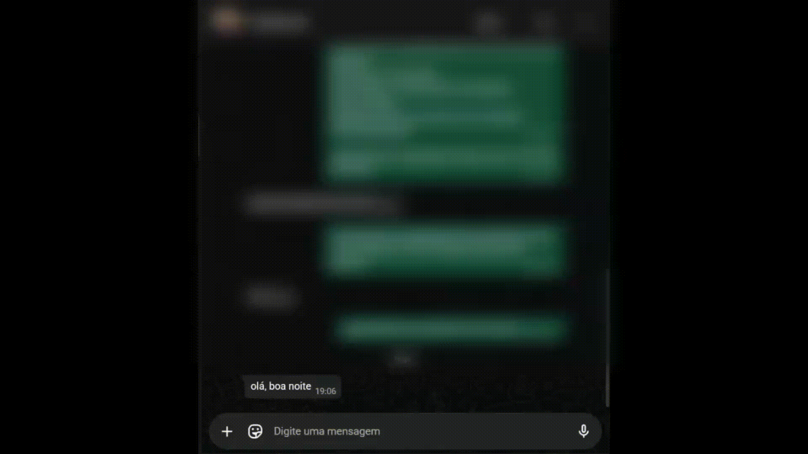
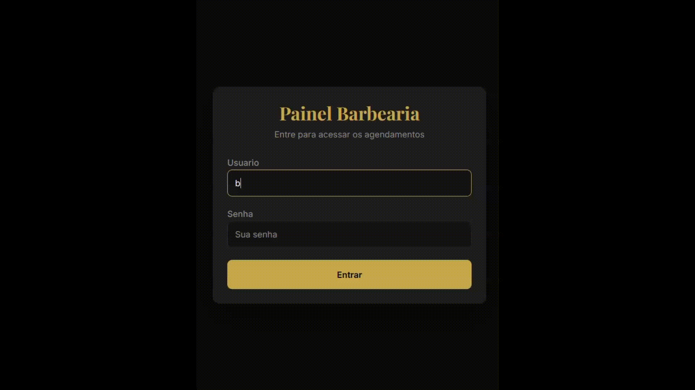

## Language / Idioma

- [Português](#barbearia-ia---sistema-de-agendamento-inteligente)
- [English](#barbershop-ai---smart-scheduling-system)

## CI Status


## Barbearia IA - Sistema de Agendamento Inteligente

Sistema de agendamento para barbearia com automação de conversas via WhatsApp e IA. Projeto monorepo com backend para regras de negócio e frontend para operação administrativa.

### 1. Contexto do problema

Durante atendimentos, o barbeiro perdia tempo respondendo manualmente mensagens de agendamento no WhatsApp. Isso gerava interrupções frequentes, atraso na confirmação de horários e risco maior de conflito entre reservas.

### 2. Stack utilizada

#### Backend

- Node.js
- TypeScript
- Fastify
- Prisma
- PostgreSQL (Neon)

#### Frontend

- React
- Vite
- TypeScript
- Tailwind CSS v4

#### Integrações

- Evolution API (WhatsApp)
- Google Gemini (Function Calling)

### 3. Funcionalidades principais

- Agendamento via WhatsApp com IA.
- Painel administrativo para operação de clientes, serviços e agenda.
- Autenticação JWT no painel.
- Prevenção de conflito de horário no agendamento.
- Notificação em caso de reagendamento.

### 4. Demonstração

**Agendamento via WhatsApp (IA)**



**Painel administrativo**



**Seleção de data e horário**


### 5. Decisões de arquitetura relevantes

- Organização em camadas: `routes` / `controllers` / `services` / `repositories`.
- Datas armazenadas em UTC, com conversão de timezone na entrada/saída.
- Cancelamento lógico de agendamento (status `CANCELADO`) em vez de exclusão física.
- Filtro anti-jailbreak no webhook do WhatsApp para bloquear entradas suspeitas.

### 6. Como rodar localmente

#### 6.1 Variáveis de ambiente

Copie e preencha as variáveis do arquivo `.env.example` em um `.env` local (sem versionar valores):

- `DATABASE_URL`
- `PORT`
- `GEMINI_API_KEY`
- `EVOLUTION_API_KEY`
- `JWT_SECRET`
- `ADMIN_USER`
- `ADMIN_PASSWORD_HASH`
- `BARBER_USER`
- `BARBER_PASSWORD_HASH`
- `BARBER_PHONE`

#### 6.2 Backend (raiz)

```bash
npm install
npm run dev
```

Build e execução de produção local:

```bash
npm run build
npm start
```

#### 6.3 Frontend (`painel/`)

```bash
cd painel
npm install
npm run dev
```

Build do frontend:

```bash
cd painel
npm run build
```

#### 6.4 Dependência Evolution API (Docker)

A integração de WhatsApp depende da Evolution API rodando via Docker. Em ambiente local, execute a Evolution API em container (normalmente em projeto/stack separado) antes de testar fluxo de webhook e envio de mensagens.

Exemplo comum:

```bash
docker-compose up -d
```

### 7. Testes

Executar testes do backend na raiz:

```bash
npm run test
```

Cobertura atual:

- Regras de negócio de `agendamento.service` (conflitos, janela de atendimento, antecedência, cancelamento lógico, notificação de reagendamento).
- Filtro anti-jailbreak no webhook (`webhook.controller`) para mensagens suspeitas, URLs, tamanho e origem de grupo.

### 8. Status do projeto

MVP validado com um cliente real, em preparação para deploy.

### 9. Autor

- Nome: Víctor Barsanele
- LinkedIn: https://linkedin.com/in/victorbarsanele
- GitHub: https://github.com/victorbarsanele

---

## CI Status


## Barbershop AI - Smart Scheduling System

Scheduling system for a barbershop with automated WhatsApp conversations powered by AI. Monorepo project with backend business rules and frontend administrative operations.

### 1. Problem context

During appointments, the barber was losing time by manually answering scheduling messages on WhatsApp. This caused frequent interruptions, slower time-slot confirmations, and higher risk of booking conflicts.

### 2. Tech stack

#### Backend

- Node.js
- TypeScript
- Fastify
- Prisma
- PostgreSQL (Neon)

#### Frontend

- React
- Vite
- TypeScript
- Tailwind CSS v4

#### Integrations

- Evolution API (WhatsApp)
- Google Gemini (Function Calling)

### 3. Core features

- AI-assisted scheduling via WhatsApp.
- Administrative dashboard for clients, services, and appointments.
- JWT authentication in the dashboard.
- Schedule conflict prevention during booking.
- Rescheduling notification flow.

### 4. Demo

**WhatsApp scheduling flow (AI)**


**Admin dashboard**


**Custom date/time picker**


### 5. Relevant architecture decisions

- Layered architecture: `routes` / `controllers` / `services` / `repositories`.
- Datetimes stored in UTC, with timezone conversion on input/output.
- Logical cancellation for appointments (`CANCELADO` status) instead of physical deletion.
- Anti-jailbreak filter in WhatsApp webhook to block suspicious input.

### 6. Local setup

#### 6.1 Environment variables

Copy and fill variables from `.env.example` into a local `.env` file (do not commit values):

- `DATABASE_URL`
- `PORT`
- `GEMINI_API_KEY`
- `EVOLUTION_API_KEY`
- `JWT_SECRET`
- `ADMIN_USER`
- `ADMIN_PASSWORD_HASH`
- `BARBER_USER`
- `BARBER_PASSWORD_HASH`
- `BARBER_PHONE`

#### 6.2 Backend (root)

```bash
npm install
npm run dev
```

Build and local production run:

```bash
npm run build
npm start
```

#### 6.3 Frontend (`painel/`)

```bash
cd painel
npm install
npm run dev
```

Frontend build:

```bash
cd painel
npm run build
```

#### 6.4 Evolution API dependency (Docker)

WhatsApp integration depends on Evolution API running through Docker. In local environment, run Evolution API in a container (usually in a separate project/stack) before testing webhook and outbound message flows.

Common example:

```bash
docker-compose up -d
```

### 7. Tests

Run backend tests from repository root:

```bash
npm run test
```

Current coverage:

- `agendamento.service` business rules (conflicts, business hours, lead time, logical cancellation, rescheduling notification).
- Anti-jailbreak webhook filter (`webhook.controller`) for suspicious content, URLs, message length, and group-origin filtering.

### 8. Project status

MVP validated with a real client, currently being prepared for deployment.

### 9. Author

- Name: Víctor Barsanele
- LinkedIn: https://linkedin.com/in/victorbarsanele
- GitHub: https://github.com/victorbarsanele
