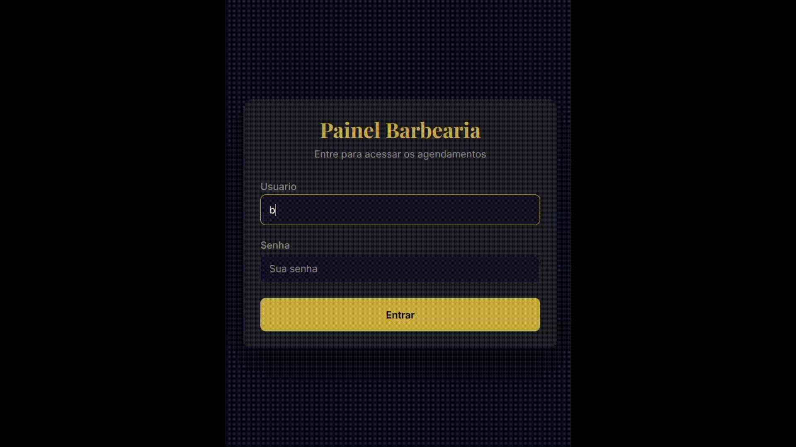

## Language / Idioma

- [Português](#barbearia-ia---sistema-de-agendamento-inteligente)
- [English](#barbershop-ai---smart-scheduling-system)

## CI Status


## Barbearia IA - Sistema de Agendamento Inteligente

Sistema de agendamento para barbearia com automação de conversas via WhatsApp e IA. Projeto monorepo com backend para regras de negócio e frontend para operação administrativa.

### 1. Contexto do problema

Durante atendimentos, o barbeiro perdia tempo respondendo manualmente mensagens de agendamento no WhatsApp. Isso gerava interrupções frequentes, atraso na confirmação de horários e risco maior de conflito entre reservas.

### 2. Stack utilizada

#### Backend

- Node.js
- TypeScript
- Fastify
- Prisma
- PostgreSQL (Neon)

#### Frontend

- React
- Vite
- TypeScript
- Tailwind CSS v4

#### Integrações

- Evolution API (WhatsApp, transporte legado)
- YCloud (WhatsApp Business Platform)
- Google Gemini (Function Calling)

### 3. Funcionalidades principais

- Agendamento via WhatsApp com IA.
- Painel administrativo para operação de clientes, serviços e agenda.
- Autenticação JWT no painel.
- Prevenção de conflito de horário no agendamento.
- Notificação em caso de reagendamento.
- Escalonamento automático para atendimento humano em casos de confusão, limite de uso da API ou solicitações fora do escopo automatizado (ex.: pacotes de agendamento recorrente).

> **Nota sobre o piloto atual:** o cliente está usando o painel administrativo para cadastro manual de clientes/serviços/agendamentos. A automação via WhatsApp está pronta e coberta por testes, mas ainda não foi conectada ao número real da barbearia.

### 4. Demonstração

**Agendamento via WhatsApp (IA)**


**Painel administrativo**



**Seleção de data e horário**


### 5. Decisões de arquitetura relevantes

- Organização em camadas: `routes` / `controllers` / `services` / `repositories`.
- Datas armazenadas em UTC, com conversão de timezone na entrada/saída.
- Cancelamento lógico de agendamento (status `CANCELADO`) em vez de exclusão física.
- Exclusion constraint no PostgreSQL (`btree_gist`) para prevenir condição de corrida na criação de agendamentos simultâneos.
- Filtro anti-jailbreak no webhook do WhatsApp para bloquear entradas suspeitas.
- Hardening de segurança da API: rate limiting (`@fastify/rate-limit`), CORS allowlist (`@fastify/cors`), cabeçalhos de segurança (`@fastify/helmet`) e JWT em cookie httpOnly.
- Pipeline de CI via GitHub Actions executando a suíte Vitest contra um container real de PostgreSQL 16, garantindo que os testes rodem contra o mesmo motor de banco usado em produção.

### 6. Como rodar localmente

#### 6.1 Variáveis de ambiente

Copie e preencha as variáveis do arquivo `.env.example` em um `.env` local (sem versionar valores):

- `DATABASE_URL`
- `PORT`
- `GEMINI_API_KEY`
- `WHATSAPP_PROVIDER` (`evolution` por padrão; ou `ycloud`)
- `EVOLUTION_API_KEY`
- `JWT_SECRET`
- `ADMIN_USER`
- `ADMIN_PASSWORD_HASH`
- `BARBER_USER`
- `BARBER_PASSWORD_HASH`
- `BARBER_PHONE`
- `COOKIE_SECURE`
- `CORS_ORIGINS`
- `ESCALATION_COOLDOWN_MS`
- `YCLOUD_API_KEY` (obrigatória com `WHATSAPP_PROVIDER=ycloud`)
- `YCLOUD_WEBHOOK_SECRET` (obrigatória com `WHATSAPP_PROVIDER=ycloud`)
- `YCLOUD_FROM_NUMBER` (obrigatória com `WHATSAPP_PROVIDER=ycloud`, formato E.164 com `+`)

#### 6.2 Backend (raiz)

```bash
npm install
npm run dev
```

Build e execução de produção local:

```bash
npm run build
npm start
```

#### 6.3 Frontend (`painel/`)

```bash
cd painel
npm install
npm run dev
```

Build do frontend:

```bash
cd painel
npm run build
```

#### 6.4 Evolution API (legado)

Evolution continua como provedor padrão para manter a operação atual. Use `WHATSAPP_PROVIDER=evolution`; Evolution API deve estar disponível conforme configuração existente.

#### 6.5 YCloud (WhatsApp Business Platform)

Configure `WHATSAPP_PROVIDER=ycloud`, `YCLOUD_API_KEY`, `YCLOUD_WEBHOOK_SECRET`, `YCLOUD_FROM_NUMBER` (E.164 com `+`) e `BARBER_PHONE`. O número do barbeiro não pode ser igual ao número conectado à YCloud.

Configure endpoint de webhook na YCloud para:

`https://barbearia-agendamento-ia.up.railway.app/webhook/ycloud`

Inscreva eventos de mensagem recebida (`whatsapp.inbound_message.received`) e eco do app (`whatsapp.smb.message.echoes`). Copie o segredo gerado no endpoint para `YCLOUD_WEBHOOK_SECRET`. O endpoint valida assinatura HMAC do corpo bruto.

Para rollback, defina `WHATSAPP_PROVIDER=evolution` e restaure a configuração Evolution. Faça redeploy e confirme `/webhook/whatsapp` e envio Evolution antes de desativar o endpoint YCloud.

Em modo YCloud, respostas dentro da conversa usam texto; notificações proativas usam os templates aprovados `aviso_reagendamento`, `aviso_cancelamento` e `aviso_atendimento_humano`.

### 7. Testes

Executar testes do backend na raiz:

```bash
npm run test
```

Cobertura atual:

- Regras de negócio de `agendamento.service` (conflitos, janela de atendimento, antecedência, cancelamento lógico, notificação de reagendamento).
- Filtro anti-jailbreak no webhook (`webhook.controller`) para mensagens suspeitas, URLs, tamanho e origem de grupo.

### 8. Status do projeto

Sistema totalmente implantado em produção (backend, frontend, banco e WhatsApp). Piloto em andamento com um cliente real: o painel administrativo já está em uso ativo para cadastro de clientes, serviços e agendamentos. A automação via WhatsApp está implementada, testada e aguardando a conexão do número da barbearia para entrar em operação com o cliente.

### 9. Autor

- Nome: Víctor Barsanele
- LinkedIn: https://linkedin.com/in/victorbarsanele
- GitHub: https://github.com/victorbarsanele

---

## Barbershop AI - Smart Scheduling System

Scheduling system for a barbershop with automated WhatsApp conversations powered by AI. Monorepo project with backend business rules and frontend administrative operations.

### 1. Problem context

During appointments, the barber was losing time by manually answering scheduling messages on WhatsApp. This caused frequent interruptions, slower time-slot confirmations, and higher risk of booking conflicts.

### 2. Tech stack

#### Backend

- Node.js
- TypeScript
- Fastify
- Prisma
- PostgreSQL (Neon)

#### Frontend

- React
- Vite
- TypeScript
- Tailwind CSS v4

#### Integrations

- Evolution API (WhatsApp, legacy transport)
- YCloud (WhatsApp Business Platform)
- Google Gemini (Function Calling)

### 3. Core features

- AI-assisted scheduling via WhatsApp.
- Administrative dashboard for clients, services, and appointments.
- JWT authentication in the dashboard.
- Schedule conflict prevention during booking.
- Rescheduling notification flow.
- Automatic escalation to human support for confusion, API rate limits, or requests outside the automated scope (e.g., recurring booking packages).

> **Note on the current pilot:** the client is currently using the admin dashboard for manual registration of clients, services, and appointments. The WhatsApp automation is fully built and tested, but not yet connected to the barbershop's real number.

### 4. Demo

**WhatsApp scheduling flow (AI)**


**Admin dashboard**


**Custom date/time picker**


### 5. Relevant architecture decisions

- Layered architecture: `routes` / `controllers` / `services` / `repositories`.
- Datetimes stored in UTC, with timezone conversion on input/output.
- Logical cancellation for appointments (`CANCELADO` status) instead of physical deletion.
- PostgreSQL exclusion constraint (`btree_gist`) to prevent race conditions on concurrent appointment creation.
- Anti-jailbreak filter in WhatsApp webhook to block suspicious input.
- API security hardening: rate limiting (`@fastify/rate-limit`), CORS allowlist (`@fastify/cors`), security headers (`@fastify/helmet`), and httpOnly cookie JWT.
- CI pipeline via GitHub Actions running the Vitest suite against a real PostgreSQL 16 container, ensuring tests run against the same database engine used in production.

### 6. Local setup

#### 6.1 Environment variables

Copy and fill variables from `.env.example` into a local `.env` file (do not commit values):

- `DATABASE_URL`
- `PORT`
- `GEMINI_API_KEY`
- `WHATSAPP_PROVIDER` (`evolution` by default, or `ycloud`)
- `EVOLUTION_API_KEY`
- `JWT_SECRET`
- `ADMIN_USER`
- `ADMIN_PASSWORD_HASH`
- `BARBER_USER`
- `BARBER_PASSWORD_HASH`
- `BARBER_PHONE`
- `COOKIE_SECURE`
- `CORS_ORIGINS`
- `ESCALATION_COOLDOWN_MS`
- `YCLOUD_API_KEY` (required with `WHATSAPP_PROVIDER=ycloud`)
- `YCLOUD_WEBHOOK_SECRET` (required with `WHATSAPP_PROVIDER=ycloud`)
- `YCLOUD_FROM_NUMBER` (required with `WHATSAPP_PROVIDER=ycloud`, E.164 with `+`)

#### 6.2 Backend (root)

```bash
npm install
npm run dev
```

Build and local production run:

```bash
npm run build
npm start
```

#### 6.3 Frontend (`painel/`)

```bash
cd painel
npm install
npm run dev
```

Frontend build:

```bash
cd painel
npm run build
```

#### 6.4 Evolution API (legacy)

Evolution remains the default provider to preserve current behavior. Set `WHATSAPP_PROVIDER=evolution`; keep Evolution API available as configured.

#### 6.5 YCloud (WhatsApp Business Platform)

Set `WHATSAPP_PROVIDER=ycloud`, `YCLOUD_API_KEY`, `YCLOUD_WEBHOOK_SECRET`, `YCLOUD_FROM_NUMBER` (E.164 with `+`) and `BARBER_PHONE`. Barber and connected YCloud numbers must differ.

Configure YCloud webhook endpoint:

`https://barbearia-agendamento-ia.up.railway.app/webhook/ycloud`

Subscribe to inbound message (`whatsapp.inbound_message.received`) and app echo (`whatsapp.smb.message.echoes`) events. Copy the endpoint secret to `YCLOUD_WEBHOOK_SECRET`; the endpoint verifies the HMAC signature against the raw body.

To roll back, set `WHATSAPP_PROVIDER=evolution`, restore Evolution configuration, redeploy, and confirm `/webhook/whatsapp` plus outbound sending before disabling the YCloud endpoint.

YCloud mode sends in-window replies as text and proactive notifications using approved templates `aviso_reagendamento`, `aviso_cancelamento` and `aviso_atendimento_humano`.

### 7. Tests

Run backend tests from repository root:

```bash
npm run test
```

Current coverage:

- `agendamento.service` business rules (conflicts, business hours, lead time, logical cancellation, rescheduling notification).
- Anti-jailbreak webhook filter (`webhook.controller`) for suspicious content, URLs, message length, and group-origin filtering.

### 8. Project status

System fully deployed to production (backend, frontend, database, and WhatsApp integration). Pilot underway with a real client: the admin dashboard is already in active use for registering clients, services, and appointments. The WhatsApp automation is implemented and tested, pending connection of the barbershop's number to go live with the client.

### 9. Author

- Name: Víctor Barsanele
- LinkedIn: https://linkedin.com/in/victorbarsanele
- GitHub: https://github.com/victorbarsanele
